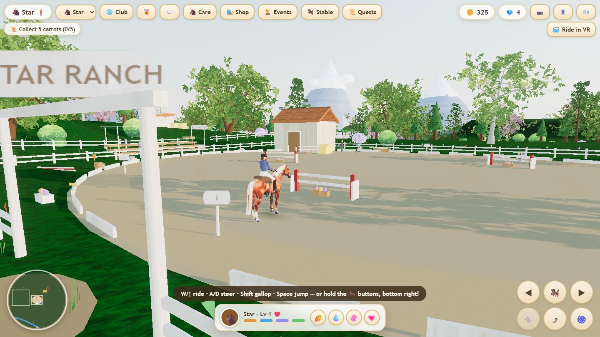
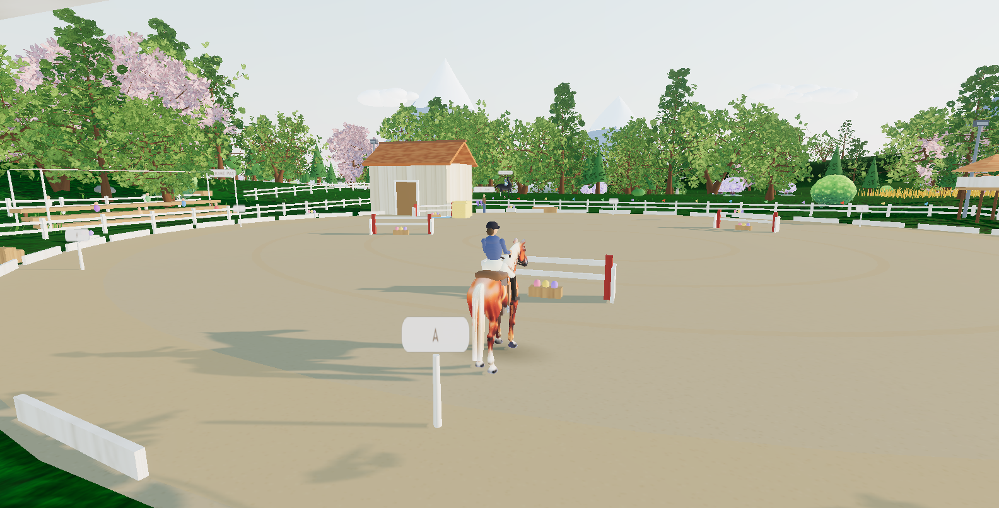
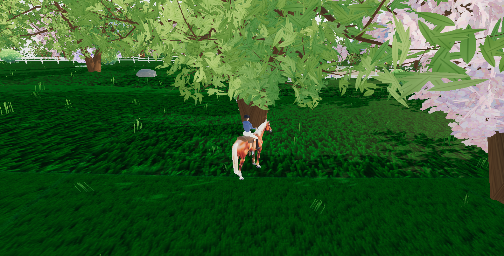

# Meadowlark Ranch 🐴

A cozy open-world horse game that runs in a browser tab. Ride across a 1000×1000
open world, care for and breed your horses, jump courses, and — on a headset —
ride the same world in VR.

Built from scratch in **one HTML file, no build step, no CDN**: clone it, serve the
folder, and it runs.

**▶️ [Play it in your browser](https://mmoritz2.github.io/meadowlark-ranch/)**



## Run it

```bash
python -m http.server 8431
```

Then open <http://127.0.0.1:8431/>. Your ranch auto-saves to `localStorage`.

For VR, serve over HTTPS (WebXR requires a secure origin) and press **Ride in VR**:

```bash
python serve-vr.py
```

## Controls

**On a screen**

| | |
|---|---|
| `W` / `↑` | ride |
| `A` / `D` | steer |
| `Shift` | gallop |
| `Space` | jump |
| `E` | mount a horse you are standing next to |
| drag / scroll | orbit and zoom |

On a phone, use the on-screen buttons.

**In VR you hold the reins**

This is the part worth trying, and the reason the VR mode exists. Rather than
steering with a thumbstick, both controllers are read as a pair of reins. Their
positions are measured against your head, so it works at any height and in any
chair with no calibration step — wherever your hands are resting when you arrive
becomes neutral.

| | |
|---|---|
| push both hands forward | move off, and further forward asks for more |
| draw both hands back | slow down; into your chest is a halt |
| draw one rein back | turn that way |
| carry both hands to one side | neck-rein that way |
| trigger | gallop |
| `A` | jump |
| `B` / `Y` | open the world-space menu |

The reins are drawn from the controllers themselves, so you watch them move as you
ride. Throttle reads the *leading* hand rather than the average, so drawing one rein
back to steer does not also pull the horse up.

The thumbstick works too. **Status → the last button on the bottom row** cycles which
input the horse listens to, and remembers it:

| | |
|---|---|
| 🎮 Either | reins or stick, whichever you are actually using wins (default) |
| 🪢 Reins | stick ignored — nothing but your hands moves the horse |
| 🕹️ Stick | reins are along for the ride but do not steer |

"Either" is the nicest way to play, but it does mean a resting hand can nudge the
horse when you meant to ride on the stick alone, so each can be picked outright.

## What's in it

| | |
|---|---|
| **World** | ~1000×1000 units of ridged hills, cliffs, a carved river with a bridge, a stream, wheat fields, desert canyon, and a snowline — one continuous mesh, coloured by slope and altitude |
| **Horses** | 19 breeds from ponies to winged mythics; care, bonding, XP and levels; breeding that blends both parents' coats; foals that grow up over real time |
| **Riding** | Speed-dependent gaits, jumping, show-jumping courses and cross-country flag races with timing, faults and trophies |
| **Living world** | Day/night with dusk window lights and fireflies, weather with rain and rainbows, wild horses to tame, NPC riders, and procedural wildlife |
| **VR** | Full WebXR mode — ride from the saddle holding the reins in your hands, with a world-space UI you operate with the controllers |
| **Multiplayer** | Ride the same world as your friends: club codes over MQTT, live remote riders on the *same* rigged horse you ride, chat with emotes and speech bubbles, shared races and club leaderboards. Every player gets a private code — you meet the people you send your invite link to, not strangers |

<p align="center">
  
  
</p>

## How it's built

Everything renders with [Three.js](https://threejs.org) (vendored, no network calls
at startup). The interesting parts are the systems written on top of it:

- **Procedural everything.** Grass, bark, water, terrain, clouds and coats are drawn
  in code to canvases or sculpted from math, so the download stays small and the
  world can be re-generated rather than authored.
- **Real branching trees.** A Weber–Penn style generator grows trunks, branches and
  leaf clusters, then bakes them into instanced meshes.
- **Seamless creatures.** Wildlife is defined as JSON primitives, shrink-wrapped into
  a single watertight skin with a smooth-minimum SDF, and animated by a shared gait
  system — so a new animal is a data file, not new code.
- **A no-tile ground shader.** Stochastic per-block UV offsets, bilinearly blended,
  kill the repeating-texture grid across the whole world.
- **Skeletal animation on a generated mesh.** The player's mount is a rigged GLB
  driven bone-by-bone: gait-correct footfall timing for walk, trot and gallop, plus
  a jump tuck, all posed as quaternions about calibrated local axes.
- **Reins as an input device.** Both controllers are read as a pair of reins in the
  horse's own frame, with the hand poses low-passed because the steering term is a
  *difference* between two hands and so carries double the tracking noise.
- **VR built for comfort, not just for support.** The rig copies the horse exactly and
  eases only across genuine discontinuities — collision push-out, landings, fast travel
  — detected as a frame step larger than anything legitimate can produce. Filtering
  ordinary motion instead was what used to leave the rider hanging beside or inside
  their own horse. A shader vignette closes in with speed to keep peripheral optical
  flow from arguing with the inner ear.
- **Performance.** Instanced foliage and critters, a graphics-quality selector, and a
  separate VR budget: foveation, a reduced eye buffer, thinned foliage, and a cheaper
  single-sample ground shader, since the ground fills most of both eyes. Props that come
  out of image-to-3D arrive at a flat 40k triangles each whatever they are, which is a
  silly price for a shrub you gallop past — they are decimated to a budget and given
  smooth normals, because the source meshes ship without any and flat shading is what
  actually makes a low-poly mesh read as low-poly.

### The art pipeline

The horse, foliage and props under `assets/models/` were generated locally rather
than bought: a reference image per asset, then image-to-3D, then texture baking, then
auto-rigging for the animated ones. `tools/asset-gen/` holds the scripts that drive it.

## Honest limitations

- The rider is a stylised procedural figure, not a production character rig.
- Multiplayer runs over a **public, unauthenticated** MQTT broker. That is fine for
  riding with friends and wrong for anything else: anyone holding a club code can join
  that room and read its chat, so a code is a password, not a username. There is no
  account system, no moderation and no server of my own — it is a demo, not a service.
- `ranch3d.html` is deliberately one large file. It is organised in sections, but it
  is a single-author codebase, not a module structure a team would share.
- Terrain collision is height-field based, so very steep cliffs can be climbed.

## Credits

Original code and generated art. Three.js and MQTT.js are vendored under their own
licenses in `assets/vendor/`. Built as a personal project by
[@mmoritz2](https://github.com/mmoritz2).

Inspired by **Star Equestrian** and **Horse Riding Tales** (Foxie Ventures) — the games
that got me interested in how a cozy horse world holds a player's attention. This is an
independent from-scratch project, not affiliated with or derived from them; any
resemblance is genre admiration, and all code and assets here are my own.

`DEVELOPMENT.md` is the full build log, including what didn't work the first time.
