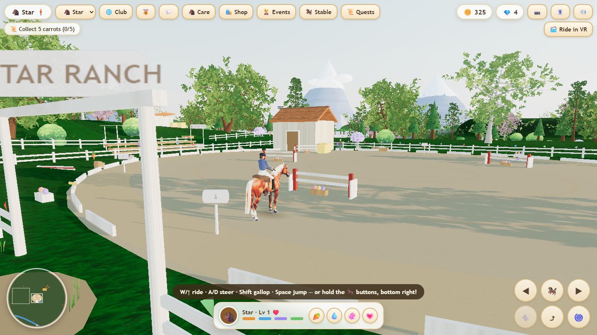
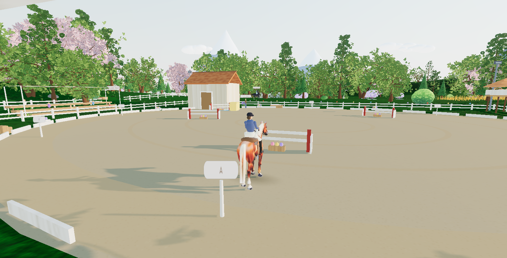
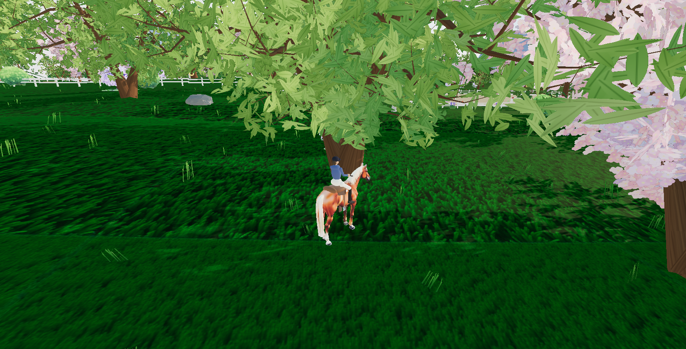

# Meadowlark Ranch 🐴

A cozy open-world horse game that runs in a browser tab. Ride across a 1000×1000
open world, care for and breed your horses, jump courses, and — on a headset —
ride the same world in VR.

Built from scratch with **no build step and no CDN**: clone it, serve the
folder, and it runs.

**▶️ [Play it in your browser](https://mmoritz2.github.io/meadowlark-ranch/)**



## Run it

```bash
python -m http.server 8431
```

Then open <http://127.0.0.1:8431/>. Your ranch auto-saves to `localStorage`.

The local **Breed Studio** is at <http://127.0.0.1:8431/breeds.html>.
The current realistic roster uses the approved WildMesh horse's native skeleton,
with breed shape, coat and grooming variants and authored walk, trot, canter,
gallop and jump motion. The older 40-joint assets are retained in the repository;
they are not the current realistic roster's foundation. See the
[runtime roster record](assets/models/native-roster/manifest.json),
[motion profiles](assets/native-breed-profiles.js), and
[source credits and restrictions](assets/models/horse-imports/ATTRIBUTION.md).
The collection also includes the original Black Dragon and European Dragon.

The current WildMesh horse and Black Dragon have noncommercial license
restrictions. Do not treat this repository as cleared for commercial release.
The [iOS development project](mobile/README.md) packages the existing game for
native testing; asset rights, device testing, signing and release gates remain
open. It is not an App Store release.

The [October playability study](docs/quality-study-2026-10-05.md) records the
reference research, tested improvements and remaining quality/release gaps.

For VR, serve over HTTPS (WebXR requires a secure origin) and press **Ride in VR**:

```bash
python serve-vr.py
```

## Rider wardrobe

Open **Rider → Outfit** for 48 free looks across Riding, Ranch, Everyday and
Adventure. Flannel, denim, overalls, knits, show jackets and trail layers have
rendered previews, alongside gingham, argyle, herringbone, Fair Isle, botanical
prints and colour-blocked tops. Top, trouser and boot colours change separately.
Changes stay in the preview until **Save**. **Undo** restores your saved look.

Clothing has fabric relief, softer folds, sewn collars and pockets, and raised
buttons. The character editor offers 30 hairstyles per body, 20 hair colours,
10 skin tones and 10 eye colours. New styles include bobs, loose waves, a half-up
twist, side and twin braids, a braided crown, natural coils and a swept pixie;
helmet fitting also applies to these styles. The newest choices include high
and bubble ponytails, a braided ponytail, long waves, half-up buns, cropped
coils and shoulder twists.

Mix in 18 free accessories across **Glasses**, **Earrings**, and **Necklaces &
scarves**. Each category has real close-up previews and a remove option. These
choices are independent of clothing and hair, are included in Save and Undo,
and appear on other riders in multiplayer.

## Controls

**On a screen**

| | |
|---|---|
| `W` / `↑` | ride |
| `A` / `D` | steer |
| `Shift` | gallop |
| `Ctrl` / `Alt` | temporary walk / trot |
| `[` / `]` | choose a slower / faster gait |
| `S` / `↓` | brake, then walk backward |
| `Space` | jump |
| `E` | mount a horse you are standing next to |
| drag / scroll | orbit and zoom |

On a phone, steer with the thumbstick and choose a gait with the pace control.
Hold **STOP** to brake, or pull the stick back to stop and then walk backward.
Drag the open world view to look around while riding.

**In VR you hold the reins**

This is the part worth trying, and the reason the VR mode exists. Rather than
steering with a thumbstick, both controllers are read as a pair of reins. Their
positions are measured against your head, so it works at any height and in any
chair with no calibration step — wherever your hands are resting when you arrive
becomes neutral.

| | |
|---|---|
| push both hands forward | move off, and further forward asks for more |
| draw both hands back | slow down; into your chest is a halt |
| draw one rein back | turn that way |
| carry both hands to one side | neck-rein that way |
| trigger | gallop |
| `A` | jump |
| `B` / `Y` | open the world-space menu |

The reins are drawn from the controllers themselves, so you watch them move as you
ride. Throttle reads the *leading* hand rather than the average, so drawing one rein
back to steer does not also pull the horse up.

The thumbstick works too. **Status → the last button on the bottom row** cycles which
input the horse listens to, and remembers it:

| | |
|---|---|
| 🎮 Either | reins or stick, whichever you are actually using wins (default) |
| 🪢 Reins | stick ignored — nothing but your hands moves the horse |
| 🕹️ Stick | reins are along for the ride but do not steer |

"Either" is the nicest way to play, but it does mean a resting hand can nudge the
horse when you meant to ride on the stick alone, so each can be picked outright.

## What's in it

| | |
|---|---|
| **World** | ~1000×1000 units of ridged hills, cliffs, a carved river with a bridge, a stream, wheat fields, desert canyon, and a snowline — one continuous mesh, coloured by slope and altitude |
| **Money** | Livery stalls that earn while you are away (how many depends on what you have built), an earnings record day by day, 49 leaderboards ranked against the ranches in the valley whether or not you are online, four rotating 28-day seasons with a 30-tier pass on a free and a gold track, and VIP bought with gems you earn by playing — there is no real money anywhere in this game |
| **Horses** | 45 horse identities: 24 real breeds, a Bay sporthorse and 20 fantasy variants. Distinct breed proportions, textured coats, individual-strand manes and tails, and draft feathering; walk, trot, canter, gallop and jump; five stats trained by forage; six temperaments; breed mastery; care, bonding, XP and levels; breeding and foals that grow over real time. The older halt tricks are not yet adapted to the new anatomical rig. |
| **Tack** | Saddle, pad, bridle and horseshoes as gear with rarity, bonuses, upgrades and merges; Silver Keys open tack chests and Grandma's locked tack room; nothing costs money |
| **Story** | Two books: Grandpa Wren's ranch, then the Silver Kestrel, a grey horse followed region by region through people to talk to, clue puzzles, and a tameable reward |
| **Ranch** | Build it: fourteen pieces placed on the ground, builder points, six ranch levels with real perks |
| **Riding** | Speed-dependent gaits, stamina, jumping judged for inspiring jumps and line riding, show-jumping courses and cross-country races with pickups, ribbons, a featured week with prize tiers, and trophies |
| **Treasure** | A treasure map: twelve chests, four collectible sets, fishing at Loon Lake, and a free camera for the photograph |
| **Living world** | Day/night with dusk window lights and fireflies, weather with rain and rainbows, wild horses to tame, NPC riders, and procedural wildlife |
| **VR** | Full WebXR mode — ride from the saddle holding the reins in your hands, with a world-space UI you operate with the controllers |
| **Multiplayer** | Ride the same world as your friends: club codes over MQTT, live remote riders on the *same* rigged horse you ride, chat with emotes and speech bubbles, trail rides you build and announce, ranch parties with confetti and a gift, shared races, Star Points and club leaderboards. Every player gets a private code — you meet the people you send your invite link to, not strangers |
| **Seasons** | On weekends the Runaway Roundup: three loose horses to calm and lead home |

<p align="center">
  
  
</p>

## How it's built

Everything renders with [Three.js](https://threejs.org) (vendored, no network calls
at startup). The interesting parts are the systems written on top of it:

- **Procedural everything.** Grass, bark, water, terrain, clouds and coats are drawn
  in code to canvases or sculpted from math, so the download stays small and the
  world can be re-generated rather than authored.
- **Real branching trees.** A Weber–Penn style generator grows trunks, branches and
  leaf clusters, then bakes them into instanced meshes.
- **Seamless creatures.** Wildlife is defined as JSON primitives, shrink-wrapped into
  a single watertight skin with a smooth-minimum SDF, and animated by a shared gait
  system — so a new animal is a data file, not new code.
- **A no-tile ground shader.** Stochastic per-block UV offsets, bilinearly blended,
  kill the repeating-texture grid across the whole world.
- **Skeletal animation on a generated mesh.** The player's mount is a rigged GLB
  driven bone-by-bone: gait-correct footfall timing for walk, trot and gallop, plus
  a jump tuck, all posed as quaternions about calibrated local axes. Every other
  horse in the world is a clone of the same rig in its own coat.
- **Hair that is hair.** The mane and tail are strips of alpha-cut strands skinned to
  the same skeleton, so they nod with the head and swing with the tail; a shader sways
  them and streams them back at the gallop. The coat is a physical material with a
  clearcoat sheen, the eyes are glossy, and both saddles are generated meshes.
- **Dragon horses.** Five of them, with membrane wings on the same folding skeleton as the
  pegasus: four fingers fan from the wrist, the skin is stretched between them and rebuilt
  from the joints every frame, so it sags at rest and billows on the downstroke. Horns, a
  spined crest, and the sun blazing through the wing skin at golden hour.
  Each breathes its own element — fire, ice, water, arcane or shadow — from one shared pool
  of billboards, and the ones grazing in the pasture do it unprompted.
- **A pegasus with a real wing.** Three folding segments — arm, forearm and hand — carry
  primaries, secondaries, tertials, three rows of coverts and an alula. Every feather is an
  instance of one cambered, alpha-cut card, so a whole wing is four draw calls; the joints
  are solved each frame, which is what lets it lie swept along the flank at a halt, lift at
  a gallop, flare over a jump and beat with a quick downstroke and a half-folded recovery.
- **Reins as an input device.** Both controllers are read as a pair of reins in the
  horse's own frame, with the hand poses low-passed because the steering term is a
  *difference* between two hands and so carries double the tracking noise.
- **VR built for comfort, not just for support.** The rig copies the horse exactly and
  eases only across genuine discontinuities — collision push-out, landings, fast travel
  — detected as a frame step larger than anything legitimate can produce. Filtering
  ordinary motion instead was what used to leave the rider hanging beside or inside
  their own horse. A shader vignette closes in with speed to keep peripheral optical
  flow from arguing with the inner ear.
- **Performance.** Instanced foliage and critters, a graphics-quality selector, and a
  separate VR budget: foveation, a reduced eye buffer, thinned foliage, and a cheaper
  single-sample ground shader, since the ground fills most of both eyes. Props that come
  out of image-to-3D arrive at a flat 40k triangles each whatever they are, which is a
  silly price for a shrub you gallop past — they are decimated to a budget and given
  smooth normals, because the source meshes ship without any and flat shading is what
  actually makes a low-poly mesh read as low-poly.

### The art pipeline

The original horses, rider, foliage and props under `assets/models/` were generated locally:
a reference image per asset, then image-to-3D, texture baking and rigging.
`tools/asset-gen/` holds the scripts that drive it. The replacement horse studies in
`assets/models/horse-candidates/` use licensed artist-authored meshes; their original
files, license records and adaptation notes are retained beside each candidate.

### September 2026 visual update

The playable game now uses a refined Blender horse with a natural, unlit coat
texture, corrected hair texture direction, and a preserved 33-bone rig. Original
ComfyUI meadow, trail, and arena materials replace the older ground textures.
The scene also has a blue sky with soft clouds, layered mountain ridges, fuller
tree canopies, tapered grass, balanced daylight, and antialiasing through the
postprocessing pipeline.

The editable source is `assets/models/horse_showcase.blend`. Rebuild commands and
rig compatibility measurements are in `tools/asset-gen/HORSE_REFINEMENT.md`;
terrain prompts, workflows, and reproduction instructions are in
`assets/textures/pastoral/README.md`. The horse retains its existing anatomy and
procedural gait system. Reaching the reference game's full character quality
still requires an authored sculpt, rider rig, and animation library.

## World realism

The ranch builder uses detailed replacements for all 55 decor pieces. Individual
boards, shaped furniture, iron fittings, stone courses, water basins, and fabric
surfaces share photographed PBR maps. Seven original CC0 Poly Haven models add
barrels, picnic tables, planters, lanterns, stumps, flowers, and hedges. Previews
use the same geometry as placed pieces; loaded scans upgrade both in place.
Saved items receive the new artwork without changing prices, positions, rotation,
or IDs. Paddocks, training rings, and wells also use the new builder models.
See `assets/models/world/builder/README.md` and `assets/textures/builder/README.md`
for sources and reproduction. `tools/qa-builder-art.cjs` renders the catalogue,
checks preview/placed parity, and verifies real placement and saved reloads;
`tools/qa-ranch.cjs` covers the existing building controls and economy.

The September 30 environment pass replaces the saturated cartoon grade with a
restrained photographic finish and adds contact shading from the scene's depth
buffer, nearby planar water reflections on High, and PBR water with moving
ripples and translucent shallows. Reflections refresh at most 15 times per
second; Medium uses fewer contact-shading samples, and Low and VR retain the
lighter direct rendering path.

Terrain now uses meadow, forest-litter and rock normal maps, with wet surface
response during rain. The ranch has matching timber battens, textured stone
foundations and weathered bridge timber. Finer grass, light transmission through
leaves, layered clouds, and broader textured mountain silhouettes complete the
lighting and materials pass. Local CC0 Poly Haven shrubs, ferns, stumps, barrels
and selected yard props are integrated from `assets/models/world/`; provenance
is retained in that directory's `SOURCE.md`. The understory is instanced in
spatial patches and culled by distance.

The downloadable-asset pass adds six **verified CC0 Poly Haven model assets**:
a detailed broadleaf tree, three pine saplings, six mossy rock variants, two rock
faces/cliffs and fallen timber. Scans replace the 74 scattered boulders and 30
meadow outcrops. Detailed trees replace nearby oak/birch placements and biome copses, capped at
12 on High and 6 on Medium; spatial batches cull off-screen crowns and shadows.
Distant trees and Low/VR use lightweight, live-lit views baked from the same tree
model to retain its silhouette. New saplings and logs stay clear of routes,
water, interactables and colliders. Original PBR maps and leaf transparency are
preserved. See `assets/models/world/realism/README.md` and its source/hash manifest.

Three photographed ground materials replace the generated pasture, forest-soil
and exposed-rock surfaces, with matched color/normal maps, roughness, and ambient
occlusion. Their sources, licenses and compressed output hashes are recorded in
`assets/textures/scanned/`. Models and ground textures add about 24 MiB; all
assets are served locally, with no third-party model requests during play.

Run `node tools/qa-world-finish.cjs` with the preview server running for actual
WebGL shader, contact-shading, reflection, asset-loading, resize and quality-tier
checks, imported-model checks and a frame-time sample. It saves ranch, stable,
meadow, river, scanned woodland/outcrop, golden-hour, night and rain captures
in `output/world-finish/`. These improvements do not establish AAA or commercial
reference parity: several characters, landmarks and props still use stylized
geometry, and reflections approximate one nearby horizontal water surface.

The world uses a denser terrain mesh with matching riding collision, continuous
downhill river and creek channels, an arched bridge at the actual crossing, and
surface materials that blend with slope, tree cover, riverbanks and climate.
Botanical trees and shrubs, curved grass blades, photographed-style generated
leaf and needle textures, and distant forest textures baked from the actual tree
meshes replace the earlier sphere/cone scenery.

Original ComfyUI materials still supply weathered timber and cedar shingles;
the main ground now uses photographed scans. Detailed barns and cottages have recessed windows,
door joinery, foundations and gutters. Canyon formations and the waterfall cliff
have eroded silhouettes, physical depth and rubble at their bases; riverbanks
have clustered sedges, reeds, gravel and driftwood. The sources and reproduction
records are in `assets/textures/realism/README.md`.

Run `node tools/qa-world.cjs` with the local server on port 8431, or pass its URL
as the first argument. This Playwright check verifies rendered terrain against
collision, downhill water, channel depth, a complete bridge crossing, and the
day/night and graphics settings. Results and screenshots go in
`output/world-validation/`. This remains an evolving game world; its characters,
some props, and procedural water still have a stylized appearance.

## Riding stability checks

Retina and large windows use a scene pixel budget (1.65 million on High,
1.1 million on Medium, 850,000 on Low), reapplied on resize and VR exit.
High retains its detailed models, clouds, contact shading and reflections,
with 2× postprocess MSAA and a 2048px shadow map. Replaced tree batches are
hidden completely, and tree detail selection uses hysteresis; unchanged
instance buffers are no longer uploaded every scenery tick.

The follow camera keeps a consistent avoidance side and anticipates travel
around corners. Rider pose blends remain bounded during slow frames, and
jumping rise is limited by actual leg reach so boots stay in the stirrups.
CPU contact sampling reads current bone transforms without repeatedly
rebuilding the horse's GPU skeleton matrices.

Run `node tools/test-follow-camera.mjs` and `node tools/test-render-budget.mjs`
for moving-wall/corner sightlines and viewport budgets. With the local server
running, `node tools/qa-riding-stability.cjs` checks actual skinned boot and rein
contacts on Bay and White Western horses, slow-frame jumps and landing,
paused poses, retired tree batches, stationary buffers and Retina resizing.
It uses a disposable save and writes its report and captures to
`output/riding-stability/`. Set `QA_PORT` for a different preview port.

## Honest limitations

- The rider is a generated mesh without a skeleton. Her lean, breathing, posting and head turn use a
  vertex shader; the rein anchors follow the same deformation. A dedicated character rig is still needed.
- Multiplayer runs over a **public, unauthenticated** MQTT broker. That is fine for
  riding with friends and wrong for anything else: anyone holding a club code can join
  that room and read its chat, so a code is a password, not a username. There is no
  account system, no moderation and no server of my own — it is a demo, not a service.
- Most systems remain in `ranch3d.html`; sky and environment art live in small local modules. It is organised in sections, but it
  is a single-author codebase, not a module structure a team would share.
- Terrain collision is height-field based, so very steep cliffs can be climbed.

## Credits

Original code, generated art and the attributed horse studies below. Three.js and MQTT.js are vendored under their own
licenses in `assets/vendor/`. Built as a personal project by
[@mmoritz2](https://github.com/mmoritz2).

Inspired by **Star Equestrian** and **Horse Riding Tales** (Foxie Ventures) — the games
that got me interested in how a cozy horse world holds a player's attention. This is an
independent from-scratch project, not affiliated with or derived from them; any
resemblance is genre admiration. No models or textures were extracted from either game.

- Replacement horse foundation: [Horse by b2przemo](https://blendswap.com/blend/13903), [CC BY 3.0](https://creativecommons.org/licenses/by/3.0/). Adapted materials, grooming and presentation. Original license and acquisition details: `assets/models/horse-candidates/b2przemo/SOURCE.md`.
- Comparison horse: [Realtime Ranchers by Lyndon Daniels](https://opengameart.org/content/realtime-ranchers-3d-model-pack), [CC0](https://creativecommons.org/publicdomain/zero/1.0/). Material paths and presentation adapted. Details: `assets/models/horse-candidates/lyndon-daniels/SOURCE.md`.

`DEVELOPMENT.md` is the full build log, including what didn't work the first time.

## Breed models and studio

Open `breeds.html` to see the new **Bay horse study** by default (`?horse=artist-study`). The existing game **Bay sporthorse** remains available at `?horse=hero`, with its revised rig, eight animation clips, gait/lead selection, pause and slow playback. The 24 earlier breed models are listed separately and retain their own names and shapes. Orbit, side/head views, clay, wireframe and hair controls work across the catalog.

The user rejected the horse artwork again on 9 September 2026. `horse-art-review.html` compares the actual artist-authored replacement studies and existing horse at the same scale and lighting. These are development studies; an anatomy comparison does not certify finished animation or commercial-reference parity.

For local preview, run `python tools/serve-preview.py` from this project and open `http://127.0.0.1:8431/breeds.html`. This serves fresh project files on localhost. The server must be running for the studio and uncached game assets to load.

The existing sporthorse's GLB, editable Blender rig/actions, source hashes and animation notes are in `assets/models/hero-horse/`. It is distinct from the earlier breed library; the same model is not relabeled as every breed.

Choose **Bay sporthorse → Ride this horse** in the studio, or **Stable → Adopt & ride · Free** in the ranch. Adoption reuses an existing sporthorse and preserves earlier horses; the selected horse persists across reloads. **Breed Studio** is also available directly in the ranch toolbar. New saves begin with a Bay sporthorse. Its runtime adapter is `assets/game-hero-horse.js`; other breeds and dragons retain their own model paths.

Editable Blender source, GLBs, shared textures, breed measurements, and reproduction instructions are in `assets/models/breeds/`. Model checks run with `python tools/validate-breed-assets.py`; gameplay checks use `node tools/qa-breeds.cjs`. These models improve breed recognition, proportions, and hair; close-up facial anatomy and motion still need further art refinement before claiming commercial reference parity.

## Ranch arrival art and camera

The arrival area now uses matching timber architecture for the barn, summoning
stall, tack room and open stable row. Original batched practice fences, botanical
planters, bound hay stacks and physical signs are in `assets/ranch-arrival-art.js`.
Arena footing gains irregular wear; foliage texture contrast is reduced before
lighting, preserving silhouettes and shadow coverage.

The follow camera sweeps against registered architecture, moves around obstructing
walls, and checks its interpolated path. VR, free camera and summoning cinematics
retain their separate controls. HUD layouts fit narrow screens; Summoning Stall
has a sticky Close button and Escape dismissal. Reward notices queue one at a
time while rewards are credited immediately.

Validation: `node tools/test-follow-camera.mjs`,
`node tools/qa-visual-quality.cjs output/visual-quality-review --camera-checks`,
and `node tools/run-web-game-skill.cjs`. The last command runs the installed game
skill client with native Windows D3D rendering. This is an art and integration
pass, not a claim of parity with the reference game's authored characters/world.
