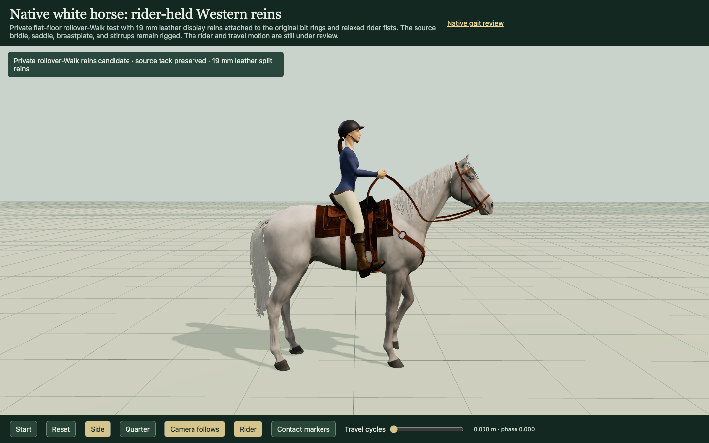
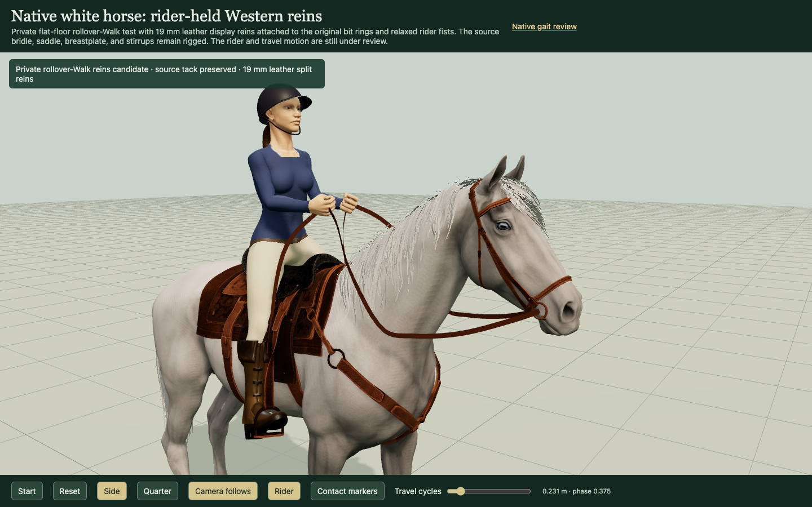

# White Western horse: mounted rollover-Walk review

Open [the private mounted preview](review.html). It uses the realistic 677-joint white horse, the `Target Native Walk Rollover` clip, and the existing 65-joint rider. The rider's boots follow the original stirrup treads; two 19 mm leather split reins now connect the **original bit rings to the rider's relaxed fists**, with loose ends draped beside the saddle. Nothing in the production horse roster or deployed game is changed.

The creator's original rein straps ended about 19–21 cm below the rider's hands. A bounded native-bone rotation study still left an 18.2 cm mean gap, moved saddle-end vertices 14 mm, and stretched a source rope edge to 1.77×. Fixed-length original rein geometry also has a measured reach shortfall of at least 12.4 cm left and 10.8 cm right, even allowing arbitrary joint rotations. The display-rein replacement addresses that specific gap without straightening the rider's elbows.

The original Western tack is a 300-component skinned mesh. [The runtime](reins.mjs) removes only 24 verified display-rein and near-bit stitch components (1,640 of 17,194 triangles) from a **cloned index buffer**. All 276 other components retain their triangles and original order. Bit rings, bridle, saddle, breastplate, and stirrups keep their original mesh, skin, binds, weights, materials, and movement. The leather ribbons use a solid rough brown material, avoiding mismatched UVs from the source texture atlas. Their bit-to-hand path follows the original skinned outer-neck rein position, then rises outside the neck to the real hand anchors. [The topology audit](component_audit.py) can reproduce the component and source-width measurements.

The combined kit first tested here had SHA-256 `552dd455873020cba95f7087d513358fd7dd26b27406e8cc36ce7c6b0da8d3e4`. After the Canter clips were added, the current `review/native-horse-kit/model.glb` is SHA-256 `49ade015b21fa531be05bc92ed042ec0dc4c2f96aabfc40b48f1fe280f292206`. Its [preservation record](../native-horse-kit/preservation.json) confirms the original scene, meshes, skin, materials and binary prefix, plus all 82 Walk channel arrays, are identical. The saved page was smoke-tested against the new combined file on port 8577: correct rollover clip, 677 horse bones, 65 rider bones, original tack intact, and zero browser errors.

The [compact evidence](evidence.json) records these checks:

- Eight side and quarter Walk phases: maximum rein join gap under `9e-16 m`, boot-to-tread gap under `5.5e-7 m`, and at least `40.7 mm` lateral clearance from the skinned neck body along the tested rein span. The relaxed elbows stay at `115.18°`.
- 512 traveling Walk phases at `0.549450549 m/s`: always 2–3 supporting hooves; whole-hoof stance minima `0.91–1.22 mm` above the fixed floor. The heel, flat and toe contact regions were measured separately. Their maximum X/Z sliding ranges were `0.00032/0.0241 mm`; lifted heels and toes were not treated as hovering feet.
- 129 rein phases: joins remained closed and the translated animation-loop seam stayed under `2.3e-8 m`.

This remains a **private display fit**: it has no rein-tension or cloth simulation. A far rein hides behind the mane from the left-quarter view. Mane-strand collision, rider fit for the other gaits, gait transitions and four-horse performance still need review before release. The 512-phase hoof measurement predates the Canter-only kit update; exact Walk and scene preservation is verified by the kit record, and the saved page's eight-phase checks were rerun on the updated file.

To reproduce, serve the repository locally, then run `NODE_PATH=$(npm root -g) QA_PORT=<port> node review/native-rider-reins/qa.cjs`, followed by `rollover-travel-qa.cjs` and `motion-qa.cjs` in the same folder. Scripts write full reports and screenshots to ignored `output/native-rider-reins-review-qa/`; the tracked folder holds only this page, its inputs, audit methods, compact evidence and two screenshots. Horse and tack: [WildMesh 3D, CC BY-NC 4.0](https://sketchfab.com/3d-models/horse-realistic-3d-model-demo-free-65d6a70a6721495f938c93e80a5998e4). Rider: Quaternius, CC0. No new model was downloaded for this fit.
